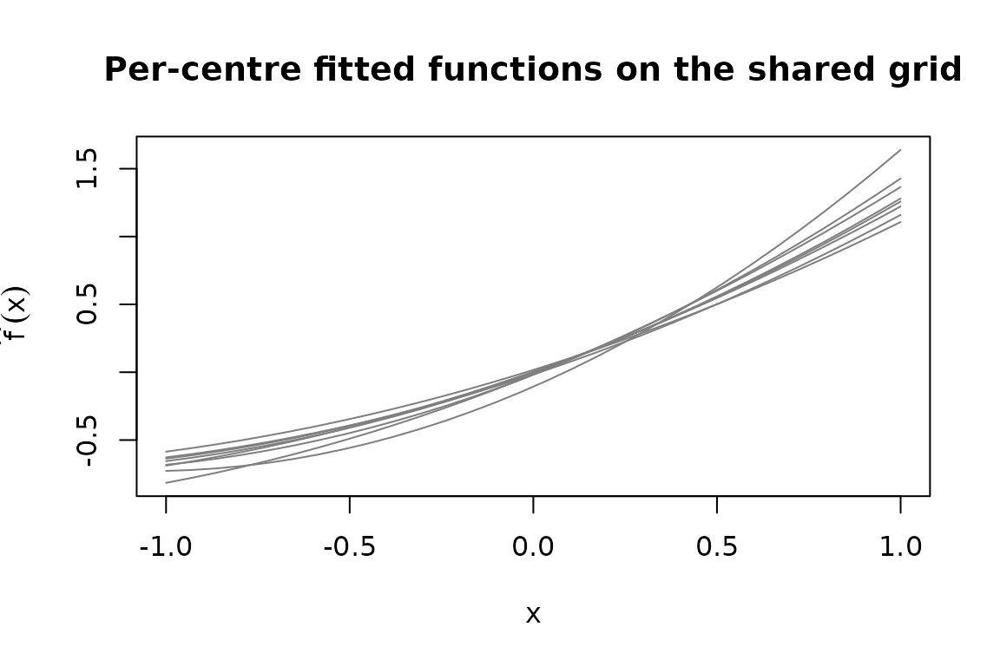

# Preparing your data: from fitted models to F_hat

``` r
library(MetaHunt)
set.seed(1)
```

## Why this step matters

Most users arrive at MetaHunt with **one fitted model per study** (a
random forest from each centre, a causal forest from each trial site, a
linear model from each cohort), not with the `m`-by-`G` numeric matrix
`F_hat` that the rest of the package consumes. The two onramp helpers in
MetaHunt —
[`build_grid()`](https://wshi18.github.io/MetaHunt/reference/build_grid.md)
and
[`f_hat_from_models()`](https://wshi18.github.io/MetaHunt/reference/f_hat_from_models.md)
— bridge that gap.

The conceptual picture is simple. Pick a finite set of “patient
profiles” (the **grid**); evaluate every centre’s model at every
profile; stack the resulting numeric vectors as rows. The output is
`F_hat`, where `F_hat[i, g]` is the prediction of centre `i`’s model at
grid point `g`.

This tutorial walks through that two-step flow and covers:

- the dispatch table
  [`f_hat_from_models()`](https://wshi18.github.io/MetaHunt/reference/f_hat_from_models.md)
  uses,
- a fully-worked dependency-free example with `lm`,
- the `predict_fn` escape hatch for custom model classes,
- a multi-dimensional grid,
- the sanity checks worth running before plugging the result into
  [`metahunt()`](https://wshi18.github.io/MetaHunt/reference/metahunt.md).

## `build_grid()`

[`build_grid()`](https://wshi18.github.io/MetaHunt/reference/build_grid.md)
constructs a data frame of grid points from any **reference
patient-level dataset**. The reference data should have the same columns
and live on the same scale as the data each centre’s model was trained
on. Common choices, in rough order of preference:

1.  **A held-out sample from the target population.** Best if you have
    one — even 50–500 rows is enough. The grid then is a draw from the
    measure you care about and the default uniform `grid_weights` is
    exactly right.
2.  **A public dataset of the same population.** For clinical work,
    e.g. NHANES, MEPS, or a national survey. For political-science
    replications, a public benchmark like the World Values Survey or
    ANES individual-level files works.
3.  **A small individual-level sample from a single source site**, if
    your privacy regime allows one site to share its covariates (but not
    outcomes). This is common in multi-site clinical trials where one
    site can provide a covariate sample under a covariate-only DUA.
4.  **A synthetic grid based on summary statistics.** If no
    individual-level data are available anywhere, construct a grid by
    sampling from marginal distributions whose moments you have agreed
    summary statistics for. This is the most permissive option but the
    least faithful — distances over the grid will reflect the
    independence assumption you imposed.

Whatever you pick, **the grid must use the same column names and
encodings the per-site models were trained with** —
[`f_hat_from_models()`](https://wshi18.github.io/MetaHunt/reference/f_hat_from_models.md)
will call `predict(model, newdata = grid)` and silently produce nonsense
if (say) factor levels disagree.

``` r
ref <- data.frame(age = rnorm(500, 60, 10),
                  bp  = rnorm(500, 130, 15),
                  bmi = rnorm(500, 28, 4))
grid <- build_grid(ref, n_grid = 50, seed = 1)
dim(grid)
#> [1] 50  3
head(grid)
#>          age        bp      bmi
#> 324 41.30211 131.21499 22.61675
#> 167 57.44973 109.91799 31.05163
#> 129 53.18340 125.20321 25.30332
#> 418 57.48835 140.33866 32.35510
#> 471 51.86756 136.83815 21.86313
#> 299 59.49434  91.05833 26.37670
```

If `n_grid` is `NULL` (or at least `nrow(reference_data)`), the full
reference data is returned unchanged. Otherwise `n_grid` rows are
sampled uniformly without replacement.

The empirical distribution of the returned grid implicitly defines the
measure `mu` used by the `L^2(mu)` inner product downstream. If your
grid is itself a representative sample of the population you care about,
the default uniform `grid_weights` is appropriate. If the grid was
sampled from one population but you want distances to reflect another,
pass non-uniform `grid_weights` proportional to the target density at
each grid point. See
[`vignette("grid-weights")`](https://wshi18.github.io/MetaHunt/articles/grid-weights.md).

## `f_hat_from_models()`

`f_hat_from_models(models, grid)` takes a list of fitted model objects
and the grid you just built, and returns the `m`-by-`G_grid` numeric
matrix `F_hat`.

### Dispatch table

Internally,
[`f_hat_from_models()`](https://wshi18.github.io/MetaHunt/reference/f_hat_from_models.md)
dispatches on each model’s class:

| Class                                                                                       | Call form                                    |
|---------------------------------------------------------------------------------------------|----------------------------------------------|
| `ranger`                                                                                    | `predict(model, data = grid)$predictions`    |
| [`grf::causal_forest`](https://rdrr.io/pkg/grf/man/causal_forest.html), `regression_forest` | `predict(model, newdata = grid)$predictions` |
| anything else                                                                               | `as.numeric(predict(model, newdata = grid))` |

The default branch covers `lm`, `glm`, `randomForest`, and most other R
model objects whose [`predict()`](https://rdrr.io/r/stats/predict.html)
method returns a numeric vector when called with `newdata`.

#### `ranger` example (not run)

``` r
library(ranger)
centre_models <- lapply(centre_data_list,
                        function(d) ranger(y ~ ., data = d))
F_hat <- f_hat_from_models(centre_models, grid)
```

#### `grf::causal_forest` example (not run)

``` r
library(grf)
centre_models <- lapply(centre_data_list,
                        function(d) causal_forest(d$X, d$Y, d$W))
F_hat <- f_hat_from_models(centre_models, grid)
```

These chunks are `eval = FALSE` so this vignette does not depend on
`ranger` or `grf` — installing either is unnecessary just to read the
tutorial.

### Worked `lm` example

To keep the tutorial fully reproducible without external dependencies,
here is a complete onramp using
[`lm()`](https://rdrr.io/r/stats/lm.html) as the per-centre model. (This
is the same `lm-onramp` flow that previously appeared in the
introductory vignette, broken out and annotated.)

``` r
m <- 8
centre_meta <- data.frame(
  region     = factor(sample(c("N", "S", "E", "W"), m, replace = TRUE)),
  mean_age   = round(runif(m, 50, 70)),
  pct_female = round(runif(m, 0.4, 0.6), 2)
)

# Each centre fits a quadratic on a single covariate `x`.
make_centre_data <- function(i) {
  x <- runif(80, -1, 1)
  beta <- centre_meta$mean_age[i] / 60      # toy effect of metadata
  data.frame(x = x, y = beta * x + 0.3 * x^2 + rnorm(80, sd = 0.2))
}
centre_models <- lapply(seq_len(m), function(i)
  stats::lm(y ~ poly(x, 2), data = make_centre_data(i)))

# A 1-D grid in the centres' covariate space.
grid_centres  <- data.frame(x = seq(-1, 1, length.out = 30))
F_hat_centres <- f_hat_from_models(centre_models, grid_centres)

dim(F_hat_centres)        # 8 x 30
#> [1]  8 30
F_hat_centres[1:3, 1:5]
#>            [,1]       [,2]       [,3]       [,4]       [,5]
#> [1,] -0.6884554 -0.6575489 -0.6241455 -0.5882450 -0.5498475
#> [2,] -0.6822055 -0.6615548 -0.6371818 -0.6090865 -0.5772689
#> [3,] -0.6552212 -0.6306971 -0.6031561 -0.5725983 -0.5390236
```

You now have `F_hat_centres` (`m × G_grid`) and `centre_meta` (`m × p`),
which are everything
[`metahunt()`](https://wshi18.github.io/MetaHunt/reference/metahunt.md)
needs.

### `predict_fn` for custom S4 / bespoke classes

If your fitted models are S4 objects, ensembles, or otherwise need
custom handling, override the dispatcher with `predict_fn`. The function
must accept `(model, grid)` and return a length-`nrow(grid)` numeric
vector:

``` r
# Toy "model" that is just a list with a slope. predict_fn evaluates it.
fake_models <- lapply(seq_len(4), function(i)
  list(slope = i / 4, intercept = 0))

custom_predict <- function(model, grid) {
  model$intercept + model$slope * grid$x
}

F_hat_custom <- f_hat_from_models(fake_models, grid_centres,
                                  predict_fn = custom_predict)
dim(F_hat_custom)         # 4 x 30
#> [1]  4 30
```

This same pattern extends to S4 model objects: write a one-line adapter
that pulls predictions out and coerces to a numeric vector.

## Multi-dimensional grids (3 covariates)

The grid does not need to be one-dimensional. With more than one
patient-level covariate, sample the grid from a multivariate reference
dataset and let [`predict()`](https://rdrr.io/r/stats/predict.html)
evaluate at each row.

``` r
# A 3-covariate reference dataset and a sub-sampled grid.
ref3   <- data.frame(age = rnorm(400, 60, 10),
                     bp  = rnorm(400, 130, 15),
                     bmi = rnorm(400, 28,  4))
grid3  <- build_grid(ref3, n_grid = 25, seed = 1)
dim(grid3)
#> [1] 25  3

# Each centre fits an lm on (age, bp, bmi); slopes vary across centres
# so there is genuine cross-centre heterogeneity to recover.
set.seed(2)
m3 <- 8
centre_data3 <- lapply(seq_len(m3), function(i) {
  n_i <- 60
  age <- rnorm(n_i, 60, 10)
  bp  <- rnorm(n_i, 130, 15)
  bmi <- rnorm(n_i, 28, 4)
  # slopes vary across centres
  beta_age <- 0.02 + 0.03 * (i / m3)
  beta_bp  <- -0.01 + 0.02 * cos(pi * i / m3)
  beta_bmi <- 0.05 - 0.04 * (i / m3)
  y <- beta_age * age + beta_bp * bp + beta_bmi * bmi + rnorm(n_i, sd = 0.3)
  data.frame(age = age, bp = bp, bmi = bmi, y = y)
})
centre_models3 <- lapply(centre_data3, function(d) stats::lm(y ~ age + bp + bmi, data = d))

F_hat3 <- f_hat_from_models(centre_models3, grid3)
dim(F_hat3)               # 8 x 25
#> [1]  8 25
```

The number of grid points `G_grid` is yours to choose. Larger grids give
finer-resolution function estimates; smaller grids run faster. A few
dozen to a few hundred is typical.

## Sanity checks

After building `F_hat`, run these quick checks before passing it into
the rest of the pipeline:

``` r
# Right shape: m studies x G grid points.
dim(F_hat3)
#> [1]  8 25

# Numeric, no NA.
is.numeric(F_hat3)
#> [1] TRUE
anyNA(F_hat3)
#> [1] FALSE

# Rows look like functions of similar magnitude (large outliers can
# dominate d-fSPA's `Delta`).
summary(apply(F_hat3, 1, function(r) c(min = min(r), max = max(r))))
#>        V1              V2              V3              V4        
#>  Min.   :3.081   Min.   :2.642   Min.   :1.807   Min.   :0.6285  
#>  1st Qu.:3.429   1st Qu.:2.992   1st Qu.:2.209   1st Qu.:1.2012  
#>  Median :3.777   Median :3.341   Median :2.612   Median :1.7738  
#>  Mean   :3.777   Mean   :3.341   Mean   :2.612   Mean   :1.7738  
#>  3rd Qu.:4.125   3rd Qu.:3.690   3rd Qu.:3.015   3rd Qu.:2.3464  
#>  Max.   :4.473   Max.   :4.039   Max.   :3.418   Max.   :2.9190  
#>        V5                V6                V7                V8         
#>  Min.   :-0.3436   Min.   :-1.1371   Min.   :-1.8484   Min.   :-1.9006  
#>  1st Qu.: 0.2655   1st Qu.:-0.4827   1st Qu.:-1.1030   1st Qu.:-1.1305  
#>  Median : 0.8745   Median : 0.1718   Median :-0.3576   Median :-0.3605  
#>  Mean   : 0.8745   Mean   : 0.1718   Mean   :-0.3576   Mean   :-0.3605  
#>  3rd Qu.: 1.4836   3rd Qu.: 0.8262   3rd Qu.: 0.3877   3rd Qu.: 0.4095  
#>  Max.   : 2.0926   Max.   : 1.4806   Max.   : 1.1331   Max.   : 1.1796
```

A quick visual check on a 1-D grid is also worth the cost:

``` r
matplot(grid_centres$x, t(F_hat_centres), type = "l", lty = 1,
        col = "grey50",
        xlab = "x", ylab = expression(hat(f)(x)),
        main = "Per-centre fitted functions on the shared grid")
```



If a single centre’s curve is wildly far from the rest, that often flags
a bug (mis-scaled covariate, an `lm` with the wrong response) rather
than a real low-rank-violating outlier.

## Common pitfalls

- **Different columns across centres.** Every centre’s model must accept
  rows of the same `grid` data frame. If centre A was fit on `(age, bp)`
  and centre B was fit on `(age, bmi)`, you cannot share a grid;
  harmonise the covariates first.
- **Categorical levels.** Factor levels in `grid` must match those the
  model saw at training. Pre-build levels explicitly with
  `factor(x, levels = ...)` if needed.
- **Wrong return shape from `predict_fn`.** Must be a length-`G_grid`
  numeric vector.
  [`f_hat_from_models()`](https://wshi18.github.io/MetaHunt/reference/f_hat_from_models.md)
  errors if the length is wrong or any value is `NA`.
- **Using a non-representative grid.** The grid implicitly defines the
  measure `mu`. A grid concentrated in one corner of covariate space
  will under-weight other regions. Either resample the grid more evenly,
  or use non-uniform `grid_weights` (see
  [`vignette("grid-weights")`](https://wshi18.github.io/MetaHunt/articles/grid-weights.md)).
- **Confusing `m × p` study covariates `W` with the patient grid.** `W`
  lives at the *study* level (one row per centre, columns like region or
  year). The grid lives at the *patient* level (one row per profile,
  columns like age and BMI). They are different objects.
