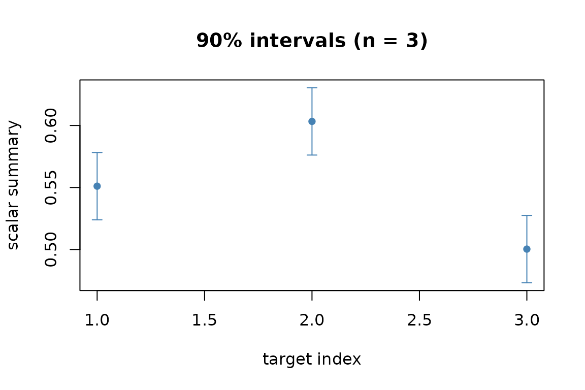

# Get started with MetaHunt

``` r
library(MetaHunt)
set.seed(1)
```

## What this is

MetaHunt is a privacy-preserving meta-analysis tool. You start with
per-study estimated functions and a row of metadata for each study, and
end with a predicted function (or scalar summary) for a new study,
together with a conformal prediction interval. This vignette shows the
shortest possible end-to-end run; for the assumptions, the three-step
pipeline, and tuning, see
[`vignette("metahunt-intro", package = "MetaHunt")`](https://wshi18.github.io/MetaHunt/articles/metahunt-intro.md).

## Inputs in 30 seconds

Two ingredients drive every function in the package.

| Object  | Description                                                                                                                      | Example                                                                                  |
|---------|----------------------------------------------------------------------------------------------------------------------------------|------------------------------------------------------------------------------------------|
| `F_hat` | An `m`-by-`G` numeric matrix. Row `i` is the function of study `i` evaluated on a *shared* set of `G` patient-level grid points. | `F_hat[i, g]` is the predicted treatment effect for centre `i` at “patient profile” `g`. |
| `W`     | An `m`-by-`p` matrix or data frame of study-level covariates (one row per study).                                                | Region, mean age, percent female, year.                                                  |

> **Starting from fitted models?** If your inputs are one fitted model
> per study (e.g. `ranger`,
> [`grf::causal_forest`](https://rdrr.io/pkg/grf/man/causal_forest.html),
> `lm`), turn them into `F_hat` first with
> [`f_hat_from_models()`](https://wshi18.github.io/MetaHunt/reference/f_hat_from_models.md)
> after building a shared evaluation grid via
> [`build_grid()`](https://wshi18.github.io/MetaHunt/reference/build_grid.md).
> See
> [`vignette("data-prep", package = "MetaHunt")`](https://wshi18.github.io/MetaHunt/articles/data-prep.md)
> for a worked example.

## A minimal end-to-end run

Simulate a small problem so the vignette has no external data
dependency:

``` r
m <- 30; G <- 20; K_true <- 2
x <- seq(0, 1, length.out = G)
basis <- rbind(sin(pi * x), x)                        # 2 true bases on the grid

W <- data.frame(w1 = rnorm(m), w2 = rnorm(m))
beta <- cbind(c(1, -0.5), c(-0.5, 1))
pi_true <- exp(as.matrix(W) %*% beta)
pi_true <- pi_true / rowSums(pi_true)

F_hat <- pi_true %*% basis + matrix(rnorm(m * G, sd = 0.05), m, G)
W_new <- data.frame(w1 = c(0, 1, -1), w2 = c(0, -0.5, 1))  # three new metadata profiles
```

Fit and get a conformal interval for the scalar wrapper `mean` (the ATE
under uniform grid weights):

``` r
res <- split_conformal(F_hat, W, W_new, K = K_true,
                       wrapper = mean, alpha = 0.1, seed = 1,
                       dfspa_args = list(denoise = FALSE))
data.frame(prediction = res$prediction,
           lower      = res$lower,
           upper      = res$upper)
#>   prediction     lower     upper
#> 1  0.5510758 0.5239399 0.5782117
#> 2  0.6033022 0.5761663 0.6304381
#> 3  0.5003344 0.4731985 0.5274703
```

## Visualising the result

[`plot()`](https://rdrr.io/r/graphics/plot.default.html) on the
conformal object renders the prediction with its band:

``` r
plot(res)
```



## Where to next

- [`vignette("metahunt-intro", package = "MetaHunt")`](https://wshi18.github.io/MetaHunt/articles/metahunt-intro.md)
  — the four assumptions, the three-step pipeline, choosing `K`,
  denoising, conformal flavours, and
  [`minmax_regret()`](https://wshi18.github.io/MetaHunt/reference/minmax_regret.md).
- [`vignette("data-prep", package = "MetaHunt")`](https://wshi18.github.io/MetaHunt/articles/data-prep.md)
  — turning per-centre fitted models into `(F_hat, W)`.
- [`?metahunt`](https://wshi18.github.io/MetaHunt/reference/metahunt.md)
  — the full pipeline reference.
