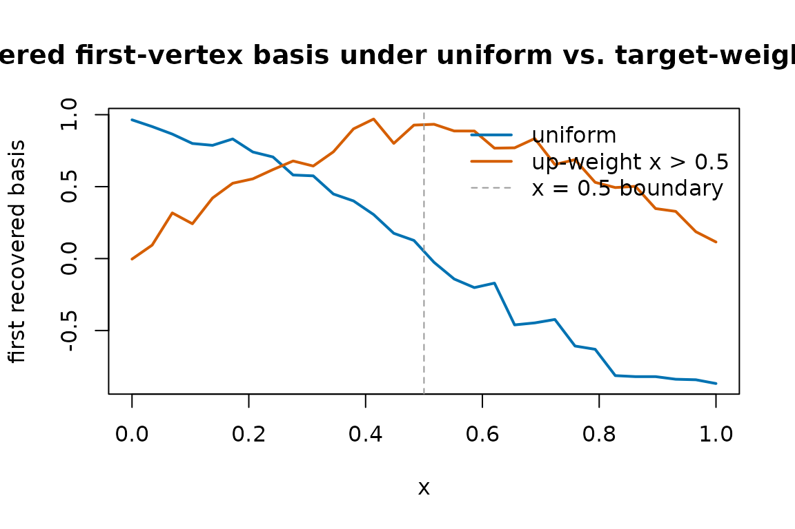

# Understanding grid_weights and the L2(mu) norm

``` r
library(MetaHunt)
set.seed(1)
```

## What `grid_weights` does

MetaHunt represents every study-level function by its values on a shared
grid `x_1, ..., x_G`. Distances between two functions `f` and `h` are
computed in a **weighted L^2 sense**:

    ||f - h||^2  =  sum_j  w_j * ( f(x_j) - h(x_j) )^2

The vector `w = grid_weights` is exactly that vector of weights — one
non-negative number per grid point. It defines the measure `mu` that the
inner product

    <f, h>_{L^2(mu)}  =  sum_j  w_j * f(x_j) * h(x_j)

is taken with respect to. Every routine in MetaHunt that talks about
“distance between functions” or “norm of a function” — basis hunting,
constrained projection, conformal pointwise scores — uses the same
`grid_weights` you supply.

## When the default is fine

The default is `grid_weights = NULL`, which inside the package becomes
the uniform vector `rep(1 / G, G)`. Every grid point counts equally.

This is the right choice when **the grid itself is a representative
sample** from the population whose functional you care about. For
example, if you sub-sampled the grid from a held-out target-population
cohort with
[`build_grid()`](https://wshi18.github.io/MetaHunt/reference/build_grid.md),
the empirical distribution of the grid already encodes the target
measure, and uniform `grid_weights` simply averages over that empirical
distribution.

In short: if your grid was sampled from population `P` and you want
distances to reflect `P`, leave `grid_weights = NULL`.

## When non-uniform `grid_weights` matter

You should override the default when the **grid distribution does not
match the population whose distances you care about**. Two common
scenarios:

- The grid was sampled from a *source* population (or a public reference
  like NHANES) but you want distances to reflect a *target* population.
  Pass `grid_weights` proportional to the target density evaluated at
  each grid point.
- You care about a sub-region of covariate space (e.g. only patients
  with `age > 65`). Set `grid_weights[j]` to `0` outside the sub-region
  and to the target density inside.

`grid_weights` does **not** need to sum to 1 — only its relative
magnitudes matter inside
[`dfspa()`](https://wshi18.github.io/MetaHunt/reference/dfspa.md) and
[`project_to_simplex()`](https://wshi18.github.io/MetaHunt/reference/project_to_simplex.md).
The default wrapper in
[`apply_wrapper()`](https://wshi18.github.io/MetaHunt/reference/apply_wrapper.md)
divides by `sum(grid_weights)`, so weighted means come out on the
natural scale regardless of normalisation.

## A worked comparison: uniform vs non-uniform

Here we generate the same data twice — `m = 40` studies, `G = 30` grid
points — and run
[`dfspa()`](https://wshi18.github.io/MetaHunt/reference/dfspa.md) with
two different `grid_weights`. The first run is uniform; the second
up-weights the right half of the grid by a factor of about 5.

``` r
m <- 40
G <- 30
x <- seq(0, 1, length.out = G)

# True bases on the grid.
basis <- rbind(sin(pi * x), cos(pi * x), x)

# Mixing weights driven by two latent covariates.
W <- data.frame(w1 = rnorm(m), w2 = rnorm(m))
beta <- cbind(c(1, -0.8), c(-0.5, 1.2), c(0, 0))
eta  <- as.matrix(W) %*% beta
pi_true <- exp(eta) / rowSums(exp(eta))

F_hat <- pi_true %*% basis + matrix(rnorm(m * G, sd = 0.05), m, G)
dim(F_hat)
#> [1] 40 30
```

Now the two `grid_weights` choices:

``` r
gw_uniform <- rep(1 / G, G)

# Up-weight x > 0.5 by ~5x. Renormalisation is optional but tidy.
gw_right   <- ifelse(x > 0.5, 5, 1)
gw_right   <- gw_right / sum(gw_right) * G   # comparable scale, optional

fit_unif  <- dfspa(F_hat, K = 3, grid_weights = gw_uniform, denoise = FALSE)
fit_right <- dfspa(F_hat, K = 3, grid_weights = gw_right,   denoise = FALSE)

# Index sets selected can differ.
fit_unif$original_indices
#> [1] 28 18 14
fit_right$original_indices
#> [1] 18 28 14
```

A single overlay plot of the two recovered first basis functions makes
the qualitative effect visible — the right-weighted run pays more
attention to the right half of the grid when ranking which study is the
“extreme” one to anchor:

``` r
matplot(
  x,
  cbind(fit_unif$bases[1, ], fit_right$bases[1, ]),
  type = "l", lty = 1, lwd = 2,
  col  = c("#0072B2", "#D55E00"),
  xlab = "x",
  ylab = "first recovered basis",
  main = "Recovered first-vertex basis under uniform vs. target-weighted L²(μ)"
)
abline(v = 0.5, lty = 2, col = "grey60")
legend("topright",
       legend = c("uniform", "up-weight x > 0.5", "x = 0.5 boundary"),
       col    = c("#0072B2", "#D55E00", "grey60"),
       lty = c(1, 1, 2), lwd = c(2, 2, 1), bty = "n")
```



The two curves usually agree closely on the well-sampled regions and
diverge where the weights differ most. The takeaway is *not* that one
choice is right and the other wrong — it is that `grid_weights` quietly
determines which features of the function get prioritised.

## Practical guidance

- Start with the default. Only switch if you have a concrete reason
  (target distribution, sub-region focus, deliberate down-weighting of
  unreliable grid points).
- Make `grid_weights` strictly positive on the support you care about.
  Zero weight at a grid point removes it from every distance, norm, and
  mean computation in the package. This includes the d-fSPA denoising
  step, which uses the same L²(μ) inner product to define
  neighbourhoods.
- Keep the same `grid_weights` across
  [`dfspa()`](https://wshi18.github.io/MetaHunt/reference/dfspa.md),
  [`project_to_simplex()`](https://wshi18.github.io/MetaHunt/reference/project_to_simplex.md),
  and the conformal routines for a given analysis. Mixing different
  `grid_weights` between steps is rarely what you want — it changes the
  meaning of “distance” mid-pipeline.
- If you only care about a scalar functional (e.g. an ATE), passing a
  `wrapper` is often a cleaner solution than re-weighting the grid. See
  [`vignette("wrapper-scalar")`](https://wshi18.github.io/MetaHunt/articles/wrapper-scalar.md).

## Functions that accept `grid_weights`

The argument has the same meaning everywhere it appears:

- `dfspa(F_hat, K, grid_weights = NULL, ...)`
- `project_to_simplex(F_hat, bases, grid_weights = NULL, ...)`
- `apply_wrapper(F_mat, wrapper = NULL, grid_weights = NULL)` — used for
  the default weighted-mean wrapper.
- `metahunt(F_hat, W, K, ..., grid_weights = NULL)` — passes the weights
  through to
  [`dfspa()`](https://wshi18.github.io/MetaHunt/reference/dfspa.md) and
  [`project_to_simplex()`](https://wshi18.github.io/MetaHunt/reference/project_to_simplex.md).
- `split_conformal(...)`, `cross_conformal(...)`,
  `conformal_from_fit(...)` — all accept `grid_weights` for the
  pointwise conformity score and for the default wrapper when none is
  supplied.
- [`reconstruction_error_curve()`](https://wshi18.github.io/MetaHunt/reference/reconstruction_error_curve.md),
  [`cv_error_curve()`](https://wshi18.github.io/MetaHunt/reference/cv_error_curve.md),
  [`select_denoising_params()`](https://wshi18.github.io/MetaHunt/reference/select_denoising_params.md)
  — propagate `grid_weights` to the underlying
  [`dfspa()`](https://wshi18.github.io/MetaHunt/reference/dfspa.md)
  calls.

If a function does not accept `grid_weights` directly, it is because it
operates on already-projected weights `pi_hat` (e.g.
[`fit_weight_model()`](https://wshi18.github.io/MetaHunt/reference/fit_weight_model.md))
and therefore does not need the grid measure.
