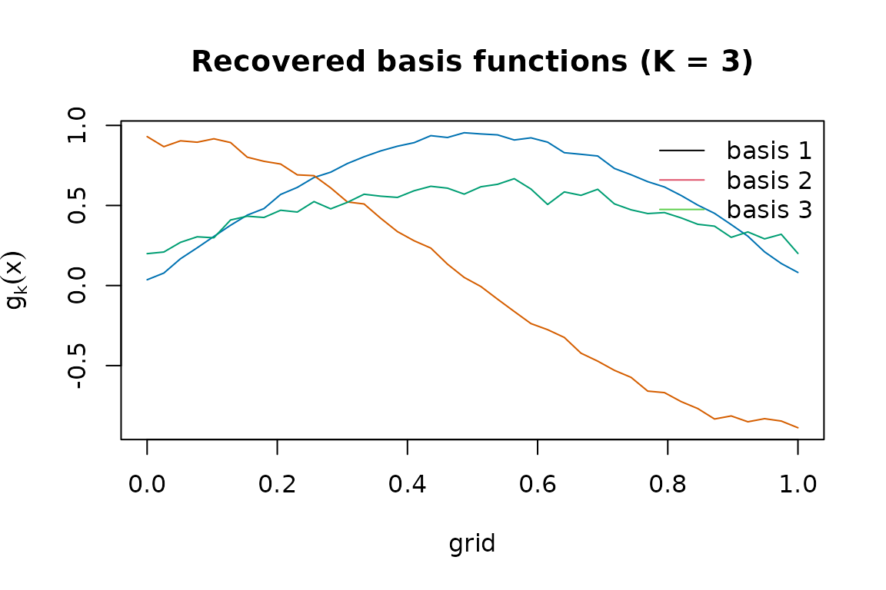
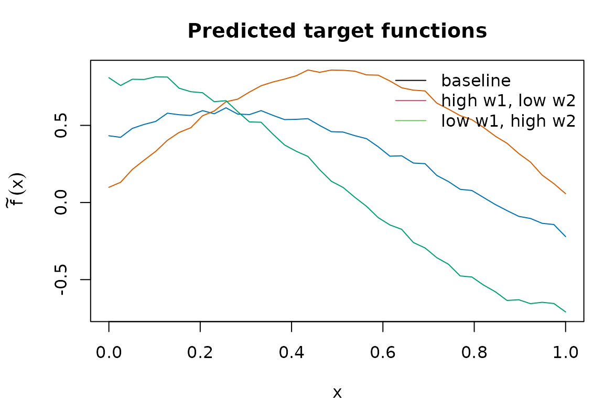

# An introduction to MetaHunt

``` r
library(MetaHunt)
set.seed(1)
```

## The problem: function-valued meta-analysis

You have several **studies** — trial centres, cohorts, sites — and each
one has produced a fitted model for some function of patient-level
covariates. That function might be a regression curve, a CATE, or a
dose-response curve. You also have **study-level metadata** for each
study: region, sample composition, year, and so on. You want to predict
that function for a *new* study, characterised only by its metadata,
together with a prediction band, and you want to do it without ever
pooling patient-level data across studies.

MetaHunt is designed for exactly that workflow. It assumes a small
number of latent **basis functions** drive cross-study heterogeneity,
recovers them from the per-study estimates, and learns how the mixing
weights depend on study-level metadata. The result is a single fitted
object that you can [`predict()`](https://rdrr.io/r/stats/predict.html)
for new metadata and combine with conformal prediction for uncertainty
quantification. If you would rather see one short example before reading
the full pipeline, start with
[`vignette("get-started", package = "MetaHunt")`](https://wshi18.github.io/MetaHunt/articles/get-started.md).

## Key assumptions

The MetaHunt pipeline rests on four assumptions. We state them in
applied-reader voice; the manuscript contains the formal statements and
proofs.

### A1. Low-rank cross-study heterogeneity

We assume the true study-level functions all live inside the convex hull
of a small number $K$ of shared *latent basis functions*. Each study is
a convex combination of the bases, with non-negative weights that sum to
one. Geometrically, every study is a point inside a $(K - 1)$-simplex
whose vertices are the basis functions; the bases are identifiable as
the vertices of that hull.

Formally, there exist basis functions $g_{1},\ldots,g_{K}$ with $K < m$
such that, for every study $i \in \{ 0,1,\ldots,m\}$,
$$f^{(i)}(\mathbf{x})\; = \;\sum\limits_{k = 1}^{K}\pi_{ik}\, g_{k}(\mathbf{x}),\qquad\mathbf{x} \in \mathcal{X},$$
with weight vector
${\mathbf{π}}_{i} = \left( \pi_{i1},\ldots,\pi_{iK} \right)^{\top} \in \Delta_{K - 1}$,
the $(K - 1)$-simplex. The bases are non-degenerate,
i.e. $g_{2} - g_{1},\ldots,g_{K} - g_{1}$ are linearly independent in
$L^{2}(\mu)$.

*What this buys you:* the entire $m$-by-grid table of study functions
collapses to $K$ shared shapes plus an $m$-by-$K$ table of weights, so
heterogeneity becomes low-dimensional and shareable.

### A2. Weight model

The mixing weight ${\mathbf{π}}_{i}$ for study $i$ is drawn from some
conditional distribution given that study’s covariates $\mathbf{W}_{i}$.
The distribution can be anything you can estimate — a Dirichlet
regression, an RKHS-Dirichlet, a multinomial logit, a nearest-neighbour
smoother. MetaHunt does not commit you to a specific functional form.

Formally, for $i = 0,1,\ldots,m$, the weight vectors are independent
draws
$${\mathbf{π}}_{i} \mid \mathbf{W}_{i}\;\overset{\text{ind.}}{\sim}\;\mathcal{P}_{{\mathbf{π}} \mid \mathbf{W}}\left( \, \cdot \mid \mathbf{W}_{i} \right),$$
where $\mathcal{P}_{{\mathbf{π}} \mid \mathbf{W}}$ is an arbitrary
distributional map from the covariate space $\mathcal{W}$ to the simplex
$\Delta_{K - 1}$.

*What this buys you:* once you can map metadata to weights, predicting
the function for a brand-new target population reduces to predicting its
weights and re-mixing the recovered bases.

### A3. Exchangeability

The studies (including the target) are exchangeable units drawn from a
common data-generating process: their joint distribution is invariant
under reordering. This is much weaker than i.i.d. and is the standard
condition under which conformal prediction is valid.

Formally, the site-level covariates
$\mathbf{W}_{0},\mathbf{W}_{1},\ldots,\mathbf{W}_{m}$ are exchangeable.
Combined with A1–A2, this implies that the triples
$$(\mathbf{W}_{i},\,{\mathbf{π}}_{i},\, f^{(i)}),\qquad i = 0,1,\ldots,m,$$
are jointly exchangeable across $i$.

*What this buys you:* the calibration step in conformal prediction
inherits a finite-sample, distribution-free coverage guarantee with no
need for parametric error models.

### A4. Estimation error control

Each study reports a noisy version of its true function,
${\widehat{f}}^{(i)} = f^{(i)} + \epsilon^{(i)}$. We assume the
within-study estimation error vanishes uniformly in the within-study
sample size, and that the number of studies $m$ does not grow too fast
relative to those sample sizes. In words: every study should be
reasonably well-estimated, and you should not have a large number of
studies whose individual sample sizes $n_{i}$ are small.

Formally, write
${\widehat{f}}^{(i)}(\mathbf{x}) = f^{(i)}(\mathbf{x}) + \epsilon^{(i)}(\mathbf{x})$.
We assume
$$\sup\limits_{\mathbf{x} \in \mathcal{X}}{\mathbb{E}}\!\left\lbrack \epsilon^{(i)}(\mathbf{x})^{2} \right\rbrack = O\!\left( n_{i}^{- r} \right)\quad{\text{for some}\mspace{6mu}}r > 0,$$
and that $m = o(\inf_{i}n_{i}^{\, a})$ for some $0 < a < r$, where
$n_{i}$ is study $i$’s sample size.

*What this buys you:* the noise in $\widehat{F}$ does not accumulate
through the pipeline, basis recovery is consistent, and conformal
intervals retain their asymptotic coverage despite a multi-stage
estimator.

## The three-step pipeline

[`metahunt()`](https://wshi18.github.io/MetaHunt/reference/metahunt.md)
is a thin wrapper around three exported steps. You can also call them
individually if you want fine-grained control.

### Step 1. Basis hunting via d-fSPA

[`dfspa()`](https://wshi18.github.io/MetaHunt/reference/dfspa.md)
extends the Successive Projection Algorithm to functions. It iteratively
picks the study whose current residual norm is largest, projects the
rest onto the orthogonal complement, and repeats $K$ times. A denoising
step averages each study with its near neighbours before the search;
this trades a small bias for substantially smaller variance when the
per-study estimates are noisy.

### Step 2. Fitting weight model

For each study,
[`project_to_simplex()`](https://wshi18.github.io/MetaHunt/reference/project_to_simplex.md)
finds the convex weights that best reconstruct its observed function
from the recovered bases.
[`fit_weight_model()`](https://wshi18.github.io/MetaHunt/reference/fit_weight_model.md)
then regresses these weight vectors on the study-level covariates `W`
using a method of your choice (default: Dirichlet regression).

### Step 3. Target prediction

[`predict.metahunt()`](https://wshi18.github.io/MetaHunt/reference/predict.metahunt.md)
takes a new metadata row $W_{0}$, predicts its weight vector through the
fitted weight model, and returns the convex combination of the recovered
bases. With `wrapper = mean` (or any other reduction) it returns a
scalar summary — for example, an ATE under a uniform grid weighting.

## A worked end-to-end example

For the rest of the vignette we work with a simulated `(F_hat, W)` so
the truth is known. In your own data, replace this block with the
data-prep onramp described in
[`vignette("data-prep")`](https://wshi18.github.io/MetaHunt/articles/data-prep.md).

``` r
G <- 40; m <- 120; K_true <- 3
x <- seq(0, 1, length.out = G)
basis <- rbind(sin(pi * x), cos(pi * x), x)         # 3 true bases on the grid

W <- data.frame(w1 = rnorm(m), w2 = rnorm(m))       # study-level covariates
beta <- cbind(c(1, -0.8), c(-0.5, 1.2), c(0, 0))
pi_true <- exp(as.matrix(W) %*% beta)
pi_true <- pi_true / rowSums(pi_true)

F_hat <- pi_true %*% basis + matrix(rnorm(m * G, sd = 0.05), m, G)
dim(F_hat)
#> [1] 120  40
```

In real data, `F_hat[i, ]` would be `predict(model_i, newdata = grid)`
and `W[i, ]` would be that centre’s metadata. The data-prep vignette
describes a one-line `lm`-based onramp.

Fit the full pipeline and inspect the recovered bases:

``` r
fit <- metahunt(F_hat, W, K = 3)
fit
#> MetaHunt fit
#>   m (studies):    120 
#>   G (grid size):  40 
#>   K (bases):      3 
#>   weight method:  dirichlet 
#>   predictors:     w1, w2
```

``` r
plot(fit, x_axis = x,
     col = c("#0072B2", "#D55E00", "#009E73"))
```



Predict the target functions for three new metadata profiles and plot
them:

``` r
W_new <- data.frame(w1 = c(0, 1, -1), w2 = c(0, -0.5, 1),
                    row.names = c("baseline", "high w1, low w2", "low w1, high w2"))
f_pred <- predict(fit, newdata = W_new)
dim(f_pred)
#> [1]  3 40
par(mar = c(4, 4.5, 3, 1))
matplot(x, t(f_pred), type = "l", lty = 1,
        col = c("#0072B2", "#D55E00", "#009E73"),
        xlab = "x", ylab = expression(tilde(f)(x)),
        main = "Predicted target functions")
legend("topright", legend = rownames(W_new),
       col = 1:3, lty = 1, bty = "n")
```



Pass a `wrapper` for a scalar summary per target (an ATE under uniform
grid weights):

``` r
predict(fit, newdata = W_new, wrapper = mean)
#> [1] 0.3318159 0.5559631 0.1020037
```

## Where to next

- [`vignette("data-prep")`](https://wshi18.github.io/MetaHunt/articles/data-prep.md)
  — turning per-centre fitted models into `(F_hat, W)` via
  [`build_grid()`](https://wshi18.github.io/MetaHunt/reference/build_grid.md)
  and
  [`f_hat_from_models()`](https://wshi18.github.io/MetaHunt/reference/f_hat_from_models.md),
  including a self-contained `lm` onramp.
- [`vignette("grid-weights")`](https://wshi18.github.io/MetaHunt/articles/grid-weights.md)
  — choosing the `grid_weights` argument and the underlying $L^{2}(\mu)$
  inner product.
- [`vignette("choosing-k-denoising")`](https://wshi18.github.io/MetaHunt/articles/choosing-k-denoising.md)
  — picking the rank $K$ and the d-fSPA denoising knobs `(N, Delta)` via
  elbow and CV diagnostics.
- [`vignette("conformal-prediction")`](https://wshi18.github.io/MetaHunt/articles/conformal-prediction.md)
  — split, cross, and from-fit conformal bands around the target
  function.
- [`vignette("wrapper-scalar")`](https://wshi18.github.io/MetaHunt/articles/wrapper-scalar.md)
  — using `wrapper = mean` and other reductions to turn function-valued
  predictions into ATEs and related scalar estimands.
- [`vignette("minmax-baseline")`](https://wshi18.github.io/MetaHunt/articles/minmax-baseline.md)
  — when to prefer the covariate-free worst-case-regret aggregator and
  how it compares to MetaHunt.
- Function-level references:
  [`?metahunt`](https://wshi18.github.io/MetaHunt/reference/metahunt.md),
  [`?dfspa`](https://wshi18.github.io/MetaHunt/reference/dfspa.md),
  [`?fit_weight_model`](https://wshi18.github.io/MetaHunt/reference/fit_weight_model.md),
  [`?predict_target`](https://wshi18.github.io/MetaHunt/reference/predict_target.md).

## References

Shi, W., Imai, K., and Zhang, Y. (2024). *Privacy-preserving
meta-analysis through low-rank basis hunting.*

Zhang, Y., Huang, M., and Imai, K. (2024). *Minimax regret estimation
for generalizing heterogeneous treatment effects with multisite data.*
arXiv:2412.11136.
