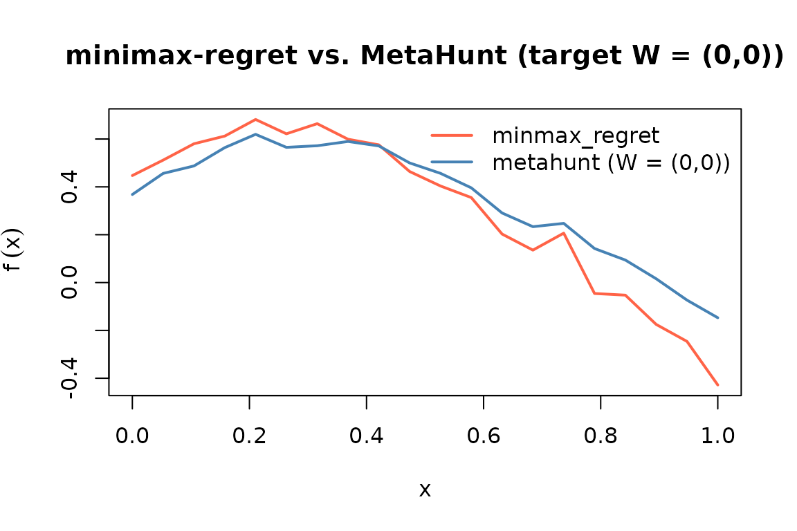

# When to prefer minmax_regret

``` r

library(MetaHunt)
set.seed(1)
```

## What `minmax_regret()` does

[`minmax_regret()`](https://wshi18.github.io/MetaHunt/reference/minmax_regret.md)
is a second top-level method exported by MetaHunt that does **not** use
study-level covariates `W`. It treats each source-site function as a
candidate target and returns the convex combination of source functions
that minimises worst-case regret across the source pool. The framing is
adversarial: rather than predicting for a specific new metadata profile,
it produces a single aggregator that is robust to the worst-case choice
of true target inside the source convex hull. See Zhang, Huang, & Imai
(2024) for the underlying theory.

## When to use which

| Use [`metahunt()`](https://wshi18.github.io/MetaHunt/reference/metahunt.md) | Use [`minmax_regret()`](https://wshi18.github.io/MetaHunt/reference/minmax_regret.md) |
|----|----|
| You have many studies (`m` $`\gtrsim 20`$) | Few studies and/or unreliable metadata |
| Study-level covariates `W` are informative | No `W`, or `W` doesn’t predict heterogeneity |
| You want predictions for **specific** new populations characterized by `W_0` | You want a single **worst-case** aggregator across the source pool |
| Random effects driven by latent structure | Adversarial / robustness framing |

## A small standalone simulation

``` r

m <- 30; G <- 20; K_true <- 3
x <- seq(0, 1, length.out = G)
basis <- rbind(sin(pi * x), cos(pi * x), x)
W <- data.frame(w1 = rnorm(m), w2 = rnorm(m))
beta <- cbind(c(1, -0.8), c(-0.5, 1.2), c(0, 0))
pi_true <- exp(as.matrix(W) %*% beta); pi_true <- pi_true / rowSums(pi_true)
F_hat <- pi_true %*% basis + matrix(rnorm(m * G, sd = 0.05), m, G)
```

``` r

W_new <- data.frame(w1 = 0, w2 = 0)
```

## Running `minmax_regret()`

``` r

mm <- minmax_regret(F_hat)
mm
#> Minimax-regret aggregator (Zhang, Huang & Imai 2024)
#>   m (sources):   30 
#>   G (grid size): 20 
#>   ridge:         1e-10 
#>   prediction:    function on grid (length 20 )
#>   top weights:
#>     source 15: q = 0.5000
#>     source 26: q = 0.5000
#>     source 10: q = 0.0000
#>     source 17: q = 0.0000
#>     source 14: q = 0.0000
```

## Visual comparison: `minmax_regret` vs `metahunt`

To compare, fit
[`metahunt()`](https://wshi18.github.io/MetaHunt/reference/metahunt.md)
and predict at the single new metadata row.

``` r

fit <- metahunt(F_hat, W, K = K_true, dfspa_args = list(denoise = FALSE))
f_pred <- predict(fit, newdata = W_new)
```

Now overlay the two predictions on the shared grid.

``` r

plot(x, mm$prediction, type = "l", col = "tomato", lwd = 2,
     ylim = range(c(mm$prediction, f_pred[1, ])),
     xlab = "x", ylab = expression(tilde(f)(x)),
     main = "minimax-regret vs. MetaHunt (target W = (0,0))")
lines(x, f_pred[1, ], col = "steelblue", lwd = 2)
legend("topright", legend = c("minmax_regret", "metahunt (W = (0,0))"),
       col = c("tomato", "steelblue"), lty = 1, lwd = 2, bty = "n")
```



## Small-`m` users

> With `m < 10`, both methods can still run but conformal intervals
> around
> [`metahunt()`](https://wshi18.github.io/MetaHunt/reference/metahunt.md)
> will be wide because the calibration set is small. We recommend
> reporting both
> [`metahunt()`](https://wshi18.github.io/MetaHunt/reference/metahunt.md)
> and
> [`minmax_regret()`](https://wshi18.github.io/MetaHunt/reference/minmax_regret.md)
> and treating large disagreement between them as a signal that the
> metadata is not informative enough to support a covariate-specific
> prediction — which is exactly the regime where the worst-case
> aggregator is the more honest answer.

## See also

- [`vignette("metahunt-intro", package = "MetaHunt")`](https://wshi18.github.io/MetaHunt/articles/metahunt-intro.md)
  — the broader pipeline and assumptions.
- [`vignette("conformal-prediction", package = "MetaHunt")`](https://wshi18.github.io/MetaHunt/articles/conformal-prediction.md)
  — for the small-`m` calibration caveat referenced above.
- [`?minmax_regret`](https://wshi18.github.io/MetaHunt/reference/minmax_regret.md)
  — the worst-case-regret aggregator.
